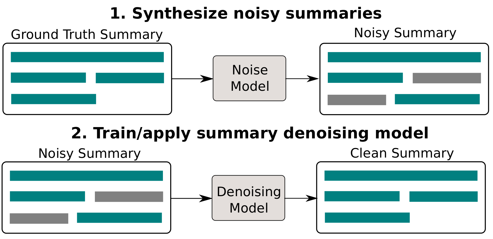

# Summary Refinement through Denoising

<!--  -->


Code for the paper [Summary Refinement through Denoising](),
presented at RANLP 2019. Implements adding noise to summaries,
training and evaluating summary denoising models.

Dependencies:

 * CNN/DM summarization dataset, follow the instructions from
 [here](https://github.com/ChenRocks/cnn-dailymail) to
 preprocess the data to JSON format.
 * The [Fairseq](https://github.com/pytorch/fairseq) library,
 we include a snapshot of fairseq from April 2019 in the `fairseq-apr19` folder.
 Additionally you will need [Pytorch](https://pytorch.org/) installed,
 we used version *1.0.1*.

## Getting started

Install all project dependencies:

```
pip install -r requirements.txt
```

Define the `CNNDM_PATH` environment variable, containing the path to the data, e.g. :

```
export CNNDM_PATH=~/data/raw/cnn_dailymail/finished_files
```

This folder should contain the `train`, `val` and `test` folders, which
should contain the JSON files of the articles.

## Running the denoising pipeline

We have implemented a full pipeline for generating noisy data
(see `preprocessing/extract_json.py` for more details), training
denoising models using the Fairseq library
(see `denoising_pipeline/train_seq2seq.sh`), for denoising several
baselines (in the `results` folder) and for computing ROUGE scores
on the denoised outputs (see the scripts in `eval/`).

The command below runs a pipeline with replace noise and
uniform probability distribution for noising up to 1 sentences,
generating 3 noisy samples for each summary.
The pipeline will be trained on GPU 0.

```
bash denoising_pipeline/denoising_pipeline.sh 0 replace 3 true true "0.15 0.85"
```

Follow `denoising_pipeline/denoising_pipeline.sh` for more details and
inline comments.

The implemented types of noise in the paper are:
 * `replace`: replaces summary sentences with their closest
 original sentences from the input article.
 * `repeat`: pick random sentences from the summary, and repeat them.
 * `extra`: get random sentences from the article and place them at their
 natural location in the summary.
 * `shuffle`: reorders the summary sentences, and
then trains a denoising model to predict the original order.
 * `mixture`: mix the `replace`, `repeat` and `extra` noises uniformly.

## Implementing a new type of noise

To implement a new type of noise, you should extent the `preprocessing/extract_json.py`
script, implementing a new noising function and registering the new noise.
Then you would be able to run the pipeline, passing the name of your noise
to `denoising_pipeline.sh`.

## Citation

```
@InProceedings{nikolov-summary-ranlp19,
  author    = {Nikolov, Nikola  and Calmanovici, Alessandro and Hahnloser, Richard},
  title     = {Summary Refinement through Denoising},
  booktitle = {Proceedings of the International Conference Recent Advances in Natural Language Processing, RANLP 2019},
  year      = {2019}
}
```